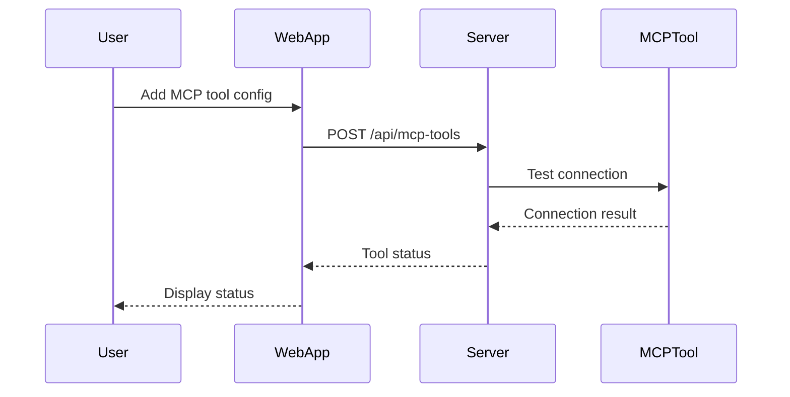
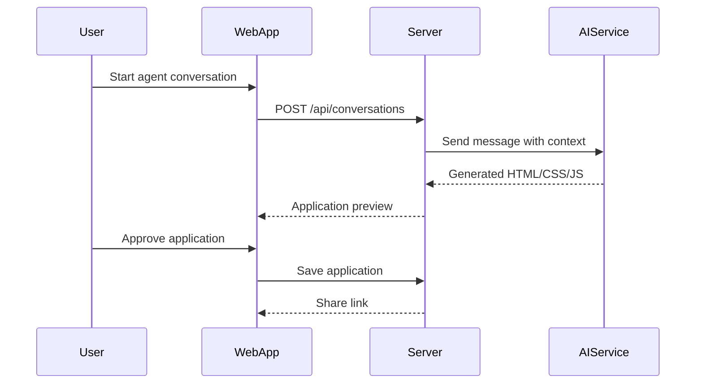

# **Colors Fullstack Architecture Document**

## **Introduction**

This document outlines the complete technical architecture for Colors - the AI-powered MCP management and application sharing platform. The architecture is designed for rapid MVP development (1-2 weeks) while maintaining extensibility for future features.

## **Change Log**

| Date | Version | Description | Author |
|------|---------|-------------|--------|
| 2025-08-27 | 1.0 | Initial architecture for Colors MVP | Architect |

## **Starter Template Selection**

**Decision**: Build from scratch with modern tooling rather than using existing templates to maintain full control over MCP integration and CLI tool requirements.

**Rationale**:

- MCP integration requires custom tooling not covered by existing templates
- CLI tool needs specific Deno compilation requirements
- Custom monorepo structure optimized for our specific use case

## **High Level Architecture**

### **Technical Summary**

Colors employs a **Jamstack architecture** with serverless functions, combining Next.js frontend with Deno edge functions backend. The system uses Supabase for data persistence and real-time features, with a Deno-compiled CLI tool for local development. This architecture prioritizes rapid development, scalability, and the unique requirement of supporting both web interfaces and CLI tooling.

### **Platform and Infrastructure Choice**

**Platform**: **Vercel + Supabase Stack**

- **Primary Reason**: Optimal for 1-2 week MVP timeline with built-in scaling
- **Key Services**:
  - Vercel: Frontend hosting, edge functions, CDN
  - Supabase: Database (PostgreSQL), authentication, real-time subscriptions
  - Deno Deploy: CLI backend for edge computing
  - npm: CLI package distribution

**Deployment Strategy**:

- **Frontend**: Vercel with global edge CDN
- **Backend**: Supabase edge functions + Deno Deploy
- **CLI**: npm package with `npx` support

### **Repository Structure**

**Monorepo with Turborepo**

```
colors/
├── apps/
│   ├── web/                    # Next.js 14 frontend
│   │   ├── src/
│   │   │   ├── app/           # App Router
│   │   │   ├── components/    # React components
│   │   │   ├── lib/          # Frontend utilities
│   │   │   └── styles/       # Tailwind + custom styles
│   │   ├── public/           # Static assets
│   │   └── package.json
│   │
│   ├── server/               # Deno backend API
│   │   ├── src/
│   │   │   ├── routes/       # API endpoints
│   │   │   ├── services/     # Business logic
│   │   │   ├── middleware/   # Auth, logging
│   │   │   └── utils/        # Server utilities
│   │   └── deno.json
│   │
│   └── cli/                  # Deno CLI tool
│       ├── src/
│       │   ├── commands/     # CLI commands
│       │   ├── services/     # MCP management
│       │   └── utils/        # CLI utilities
│       └── deno.json
│
├── packages/
│   ├── shared/               # Shared types and utilities
│   │   ├── src/
│   │   │   ├── types/        # TypeScript types
│   │   │   ├── schemas/      # Validation schemas
│   │   │   └── constants/    # Shared constants
│   │   └── package.json
│   │
│   └── ui/                   # Shared UI components
│       ├── src/
│       │   ├── components/   # Reusable components
│       │   └── hooks/        # Custom React hooks
│       └── package.json
│
├── infrastructure/           # Deployment configurations
│   ├── terraform/           # IaC for resources
│   └── docker/             # Container configs
│
├── scripts/                 # Build and deployment scripts
├── docs/                    # Documentation
│   ├── prd.md
│   ├── front-end-spec.md
│   └── fullstack-architecture.md
│
├── .env.example             # Environment template
├── turbo.json              # Turborepo configuration
├── package.json            # Root package.json
└── README.md
```

## **Tech Stack**

### **Technology Stack Table**

| Category | Technology | Version | Purpose | Rationale |
|----------|------------|---------|---------|-----------|
| **Frontend Language** | TypeScript | 5.3.3 | Type safety across stack | Excellent tooling, catches errors early |
| **Frontend Framework** | Next.js | 14.2.5 | React framework with SSR | Optimal performance, edge computing support |
| **UI Component Library** | shadcn/ui | Latest | Pre-built components | Developer-friendly, customizable, modern |
| **Styling** | Tailwind CSS | 3.4.1 | Utility-first CSS | Rapid development, consistent styling |
| **AI Integration** | Vercel AI SDK | 3.2.0 | AI streaming and tools | Built for Next.js, excellent DX |
| **State Management** | Zustand | 4.5.2 | Lightweight state management | Simple API, TypeScript-first |
| **Backend Runtime** | Deno | 2.x | TypeScript runtime | Modern, secure, built-in TypeScript |
| **Backend Framework** | Hono | 4.x | Fast web framework | Edge-optimized, TypeScript-native |
| **API Style** | REST + WebSockets | - | Real-time MCP debugging | WebSocket for streaming logs |
| **Database** | Supabase PostgreSQL | 15+ | PostgreSQL with real-time | Built-in auth, real-time subscriptions |
| **Authentication** | Supabase Auth | Latest | User management | Row-level security, social logins |
| **File Storage** | Supabase Storage | Latest | Application storage | CDN-ready, access controls |
| **Frontend Testing** | Vitest + React Testing Library | Latest | Component testing | Fast, modern testing |
| **Backend Testing** | Deno Test | Built-in | API testing | Native Deno testing |
| **E2E Testing** | Playwright | 1.45.0 | End-to-end testing | Cross-browser, reliable |
| **Build Tool** | Turborepo | 2.0.6 | Monorepo management | Fast builds, caching |
| **Bundler** | Next.js (built-in) | 14.2.5 | Frontend bundling | Optimized for edge deployment |
| **IaC Tool** | Terraform | 1.8+ | Infrastructure as code | Multi-cloud support |
| **CI/CD** | GitHub Actions | Latest | Automated deployment | Integrated with GitHub |
| **Monitoring** | Vercel Analytics | Built-in | Performance monitoring | Real-time insights |
| **Logging** | Supabase Logs | Built-in | Application logging | Centralized logging |
| **CLI Package** | npm | - | Global distribution | `npx colors-ai` support |

## **Data Models**

### **Core Data Models**

#### **User Model**

```typescript
interface User {
  id: string;                    // UUID
  email: string;                // Unique email
  username: string;            // Unique username
  avatar_url?: string;         // Profile picture
  created_at: Date;
  updated_at: Date;
  
  // Preferences
  preferences: {
    theme: 'light' | 'dark' | 'system';
    notifications: boolean;
    language: string;
  };
}
```

#### **MCP Tool Configuration**

```typescript
interface MCPTool {
  id: string;                  // UUID
  name: string;               // Display name
  type: string;               // Tool type (server, client)
  connection_config: {
    host: string;
    port: number;
    auth?: {
      type: 'token' | 'key' | 'none';
      value?: string;
    };
  };
  status: 'connected' | 'disconnected' | 'error';
  metadata: {
    description: string;
    version: string;
    capabilities: string[];
  };
  user_id: string;            // Foreign key to users
  created_at: Date;
  updated_at: Date;
}
```

#### **API Key Management**

```typescript
interface APIKey {
  id: string;                 // UUID
  service: string;            // 'openai' | 'anthropic' | 'google' | etc.
  encrypted_key: string;      // Encrypted API key
  name: string;              // User-friendly name
  is_shared: boolean;        // Whether to share with others
  usage_limits?: {
    requests_per_day?: number;
    requests_per_hour?: number;
  };
  user_id: string;
  created_at: Date;
  updated_at: Date;
}
```

#### **Application Model**

```typescript
interface Application {
  id: string;                // UUID
  name: string;              // Application name
  description: string;       // User description
  html_content: string;      // Generated HTML
  css_content?: string;      // Optional CSS
  js_content?: string;       // Optional JavaScript
  prompt: string;            // Original prompt used
  mcp_tools: string[];       // Tools used in creation
  api_keys: string[];        // API keys required
  visibility: 'private' | 'public' | 'shared';
  share_url?: string;        // Generated share link
  usage_stats: {
    views: number;
    uses: number;
    bookmarks: number;
  };
  user_id: string;          // Creator
  created_at: Date;
  updated_at: Date;
}
```

#### **Conversation Model**

```typescript
interface Conversation {
  id: string;               // UUID
  title: string;           // Generated title
  messages: Message[];
  application_id?: string; // If created app
  mcp_tools: string[];     // Tools used
  user_id: string;
  created_at: Date;
  updated_at: Date;
}

interface Message {
  id: string;
  role: 'user' | 'assistant' | 'system';
  content: string;
  timestamp: Date;
  metadata?: {
    tool_calls?: any[];
    tokens?: number;
  };
}
```

## **API Specification**

### **REST API + WebSocket Endpoints**

#### **Authentication Endpoints**

```yaml
POST   /api/auth/signup
POST   /api/auth/login
POST   /api/auth/logout
GET    /api/auth/session
```

#### **MCP Tool Management**

```yaml
GET    /api/mcp-tools           # List user's MCP tools
POST   /api/mcp-tools           # Add new MCP tool
GET    /api/mcp-tools/:id       # Get tool details
PUT    /api/mcp-tools/:id       # Update tool config
DELETE /api/mcp-tools/:id       # Remove tool
POST   /api/mcp-tools/:id/test  # Test connection
```

#### **API Key Management**

```yaml
GET    /api/api-keys            # List API keys
POST   /api/api-keys            # Add new API key
PUT    /api/api-keys/:id        # Update key settings
DELETE /api/api-keys/:id        # Remove API key
```

#### **Applications**

```yaml
GET    /api/applications        # Browse applications
POST   /api/applications        # Create new application
GET    /api/applications/:id    # Get application details
PUT    /api/applications/:id    # Update application
DELETE /api/applications/:id    # Remove application
POST   /api/applications/:id/share # Generate share link
```

#### **Agent Conversations**

```yaml
POST   /api/conversations       # Start new conversation
GET    /api/conversations       # List conversations
GET    /api/conversations/:id   # Get conversation
POST   /api/conversations/:id/message # Send message
```

#### **WebSocket Endpoints**

```yaml
ws://api/colors/mcp-debug/:tool_id  # Real-time MCP debugging
ws://api/colors/agent-chat/:conversation_id  # Streaming chat
```

## **Components**

### **Frontend Components**

#### **Core Components**

**MCPDashboard** (apps/web/src/components/mcp/)

- **Responsibility**: MCP tool management interface
- **Key Interfaces**:
  - `useMCPTools()` hook for state management
  - `MCPConnectionTester` for connection validation
- **Dependencies**: Zustand store, Supabase realtime
- **Technology**: React 18, Tailwind, shadcn/ui

**AgentChat** (apps/web/src/components/agent/)

- **Responsibility**: Conversational AI interface
- **Key Interfaces**:
  - `useAgentChat()` hook for conversation state
  - `MessageRenderer` for displaying messages
- **Dependencies**: Vercel AI SDK, WebSocket connection
- **Technology**: React 18, Vercel AI SDK, TypeScript

**ApplicationGallery** (apps/web/src/components/gallery/)

- **Responsibility**: Application browsing and management
- **Key Interfaces**:
  - `useApplications()` hook for app data
  - `AppPreview` component for live previews
- **Dependencies**: Supabase queries, CDN for previews
- **Technology**: React 18, Tailwind, shadcn/ui

### **Backend Services**

#### **MCP Service** (apps/server/src/services/mcp.ts)

- **Responsibility**: MCP tool management and debugging
- **Key Interfaces**:
  - `connectMCP(config: MCPToolConfig)`
  - `testConnection(toolId: string)`
  - `getToolLogs(toolId: string)`
- **Dependencies**: MCP client libraries, WebSocket server
- **Technology**: Deno, TypeScript, WebSocket

#### **API Router Service** (apps/server/src/services/api-router.ts)

- **Responsibility**: AI API key management and routing
- **Key Interfaces**:
  - `storeAPIKey(service: string, key: string)`
  - `routeRequest(service: string, request: any)`
  - `validateUsage(keyId: string)`
- **Dependencies**: Encryption library, rate limiting
- **Technology**: Deno, TypeScript, Supabase

#### **Application Generator** (apps/server/src/services/app-generator.ts)

- **Responsibility**: Generate applications from conversations
- **Key Interfaces**:
  - `generateApp(prompt: string, tools: string[])`
  - `validateApp(html: string)`
  - `createShareLink(appId: string)`
- **Dependencies**: AI SDK, HTML validation
- **Technology**: Deno, Vercel AI SDK, TypeScript

### **CLI Components**

#### **MCPToolCommand** (apps/cli/src/commands/mcp.ts)

- **Responsibility**: MCP tool debugging in CLI
- **Key Interfaces**:
  - `connectTool(config: MCPToolConfig)`
  - `debugTool(toolId: string)`
  - `listTools()`
- **Dependencies**: MCP client, terminal UI
- **Technology**: Deno, TypeScript, terminal libraries

## **Core Workflows**

### **MCP Tool Connection Flow**



### **Application Creation Flow**



## **REST API Specification**

```yaml
openapi: 3.0.0
info:
  title: Colors API
  version: 1.0.0
  description: AI-powered MCP management and application sharing platform

servers:
  - url: https://colors-api.vercel.app
    description: Production server

paths:
  /api/mcp-tools:
    get:
      summary: List MCP tools
      security:
        - bearerAuth: []
      responses:
        200:
          description: List of MCP tools
          content:
            application/json:
              schema:
                type: array
                items:
                  $ref: '#/components/schemas/MCPTool'
    
    post:
      summary: Add MCP tool
      security:
        - bearerAuth: []
      requestBody:
        required: true
        content:
          application/json:
            schema:
              $ref: '#/components/schemas/MCPToolConfig'
      responses:
        201:
          description: Tool added successfully

components:
  schemas:
    MCPTool:
      type: object
      properties:
        id:
          type: string
          format: uuid
        name:
          type: string
        status:
          type: string
          enum: [connected, disconnected, error]
        connection_config:
          type: object
          
    MCPToolConfig:
      type: object
      required: [name, type, connection_config]
      properties:
        name:
          type: string
        type:
          type: string
        connection_config:
          type: object
```

## **Database Schema**

```sql
-- Users table (managed by Supabase Auth)
CREATE TABLE users (
    id UUID PRIMARY KEY DEFAULT gen_random_uuid(),
    email TEXT UNIQUE NOT NULL,
    username TEXT UNIQUE NOT NULL,
    avatar_url TEXT,
    preferences JSONB DEFAULT '{}',
    created_at TIMESTAMP WITH TIME ZONE DEFAULT NOW(),
    updated_at TIMESTAMP WITH TIME ZONE DEFAULT NOW()
);

-- MCP Tools table
CREATE TABLE mcp_tools (
    id UUID PRIMARY KEY DEFAULT gen_random_uuid(),
    user_id UUID REFERENCES users(id) ON DELETE CASCADE,
    name TEXT NOT NULL,
    type TEXT NOT NULL,
    connection_config JSONB NOT NULL,
    status TEXT CHECK (status IN ('connected', 'disconnected', 'error')),
    metadata JSONB DEFAULT '{}',
    created_at TIMESTAMP WITH TIME ZONE DEFAULT NOW(),
    updated_at TIMESTAMP WITH TIME ZONE DEFAULT NOW()
);

-- API Keys table
CREATE TABLE api_keys (
    id UUID PRIMARY KEY DEFAULT gen_random_uuid(),
    user_id UUID REFERENCES users(id) ON DELETE CASCADE,
    service TEXT NOT NULL,
    encrypted_key TEXT NOT NULL,
    name TEXT NOT NULL,
    is_shared BOOLEAN DEFAULT FALSE,
    usage_limits JSONB DEFAULT '{}',
    created_at TIMESTAMP WITH TIME ZONE DEFAULT NOW(),
    updated_at TIMESTAMP WITH TIME ZONE DEFAULT NOW()
);

-- Applications table
CREATE TABLE applications (
    id UUID PRIMARY KEY DEFAULT gen_random_uuid(),
    user_id UUID REFERENCES users(id) ON DELETE CASCADE,
    name TEXT NOT NULL,
    description TEXT,
    html_content TEXT NOT NULL,
    css_content TEXT,
    js_content TEXT,
    prompt TEXT NOT NULL,
    mcp_tools TEXT[],
    api_keys TEXT[],
    visibility TEXT CHECK (visibility IN ('private', 'public', 'shared')),
    share_url TEXT UNIQUE,
    usage_stats JSONB DEFAULT '{"views": 0, "uses": 0, "bookmarks": 0}',
    created_at TIMESTAMP WITH TIME ZONE DEFAULT NOW(),
    updated_at TIMESTAMP WITH TIME ZONE DEFAULT NOW()
);

-- Conversations table
CREATE TABLE conversations (
    id UUID PRIMARY KEY DEFAULT gen_random_uuid(),
    user_id UUID REFERENCES users(id) ON DELETE CASCADE,
    title TEXT NOT NULL,
    application_id UUID REFERENCES applications(id),
    mcp_tools TEXT[],
    created_at TIMESTAMP WITH TIME ZONE DEFAULT NOW(),
    updated_at TIMESTAMP WITH TIME ZONE DEFAULT NOW()
);

-- Messages table
CREATE TABLE messages (
    id UUID PRIMARY KEY DEFAULT gen_random_uuid(),
    conversation_id UUID REFERENCES conversations(id) ON DELETE CASCADE,
    role TEXT CHECK (role IN ('user', 'assistant', 'system')),
    content TEXT NOT NULL,
    metadata JSONB DEFAULT '{}',
    created_at TIMESTAMP WITH TIME ZONE DEFAULT NOW()
);

-- Indexes for performance
CREATE INDEX idx_mcp_tools_user_id ON mcp_tools(user_id);
CREATE INDEX idx_api_keys_user_id ON api_keys(user_id);
CREATE INDEX idx_applications_user_id ON applications(user_id);
CREATE INDEX idx_applications_share_url ON applications(share_url);
CREATE INDEX idx_conversations_user_id ON conversations(user_id);
CREATE INDEX idx_messages_conversation_id ON messages(conversation_id);
```

## **Source Tree**

```plaintext
colors/
├── apps/
│   ├── web/
│   │   ├── src/
│   │   │   ├── app/
│   │   │   │   ├── (auth)/
│   │   │   │   │   ├── login/
│   │   │   │   │   └── register/
│   │   │   │   ├── (dashboard)/
│   │   │   │   │   ├── dashboard/
│   │   │   │   │   ├── mcp-tools/
│   │   │   │   │   └── settings/
│   │   │   │   ├── (agent)/
│   │   │   │   │   └── agent/
│   │   │   │   ├── (gallery)/
│   │   │   │   │   └── gallery/
│   │   │   │   ├── api/
│   │   │   │   │   ├── auth/
│   │   │   │   │   ├── mcp-tools/
│   │   │   │   │   ├── applications/
│   │   │   │   │   └── conversations/
│   │   │   │   └── globals.css
│   │   │   ├── components/
│   │   │   │   ├── ui/          # shadcn/ui components
│   │   │   │   ├── mcp/         # MCP-specific components
│   │   │   │   ├── agent/       # Agent chat components
│   │   │   │   └── gallery/     # Gallery components
│   │   │   ├── lib/
│   │   │   │   ├── supabase/    # Supabase client
│   │   │   │   ├── hooks/       # Custom hooks
│   │   │   │   └── utils/       # Frontend utilities
│   │   │   └── store/           # Zustand stores
│   │   ├── public/
│   │   │   ├── icons/
│   │   │   └── images/
│   │   ├── next.config.js
│   │   ├── package.json
│   │   └── tailwind.config.js
│   │
│   ├── server/
│   │   ├── src/
│   │   │   ├── routes/
│   │   │   │   ├── auth.ts
│   │   │   │   ├── mcp-tools.ts
│   │   │   │   ├── applications.ts
│   │   │   │   ├── conversations.ts
│   │   │   │   └── websocket.ts
│   │   │   ├── services/
│   │   │   │   ├── mcp-service.ts
│   │   │   │   ├── ai-service.ts
│   │   │   │   └── app-generator.ts
│   │   │   ├── middleware/
│   │   │   │   ├── auth.ts
│   │   │   │   ├── rate-limit.ts
│   │   │   │   └── logging.ts
│   │   │   ├── utils/
│   │   │   │   ├── encryption.ts
│   │   │   │   └── validation.ts
│   │   │   └── main.ts
│   │   ├── deno.json
│   │   └── .env.example
│   │
│   └── cli/
│       ├── src/
│       │   ├── commands/
│       │   │   ├── dev.ts
│       │   │   ├── mcp.ts
│       │   │   └── config.ts
│       │   ├── services/
│       │   │   ├── mcp-debug.ts
│       │   │   └── config-manager.ts
│       │   └── main.ts
│       ├── deno.json
│       └── .env.example
│
├── packages/
│   ├── shared/
│   │   ├── src/
│   │   │   ├── types/
│   │   │   │   ├── mcp.ts
│   │   │   │   ├── api.ts
│   │   │   │   └── application.ts
│   │   │   ├── schemas/
│   │   │   │   ├── validation.ts
│   │   │   │   └── api-schemas.ts
│   │   │   └── constants/
│   │   │       └── index.ts
│   │   └── package.json
│   │
│   ├── ui/
│   │   ├── src/
│   │   │   ├── components/
│   │   │   └── hooks/
│   │   └── package.json
│   │
│   └── config/
│       ├── eslint/
│       ├── typescript/
│       └── tailwind/
│
├── infrastructure/
│   ├── terraform/
│   │   ├── vercel.tf
│   │   └── supabase.tf
│   └── github/
│       └── workflows/
│
├── scripts/
│   ├── build.sh
│   ├── deploy.sh
│   └── dev.sh
│
├── docs/
│   ├── prd.md
│   ├── front-end-spec.md
│   ├── fullstack-architecture.md
│   └── api-docs.md
│
├── .env.example
├── turbo.json
├── package.json
└── README.md
```

## **Infrastructure and Deployment**

### **Infrastructure as Code**

**Tool**: Terraform with Vercel and Supabase providers
**Location**: `infrastructure/terraform/`

**Key Resources**:

- Vercel project with environment variables
- Supabase project with database and auth
- DNS configuration for custom domain
- Environment-specific configurations

### **Deployment Strategy**

**Strategy**: Git-based deployment with automatic CI/CD
**CI/CD Platform**: GitHub Actions

**Pipeline Configuration**: `.github/workflows/deploy.yml`

**Environment Promotion Flow**:

```
Git Push → GitHub Actions → Vercel Preview → Manual Review → Vercel Production
```

**Rollback Strategy**:

- **Primary**: Vercel instant rollback via dashboard
- **Secondary**: Git revert and redeploy
- **Database**: Supabase point-in-time recovery
- **CLI**: npm package version rollback

### **Environments**

| Environment | Frontend URL | Backend URL | Purpose |
|-------------|--------------|-------------|---------|
| Development | localhost:3000 | localhost:8000 | Local development |
| Preview | *.vercel.app | *.vercel.app | Pull request previews |
| Production | colors.app | api.colors.app | Live environment |

## **Error Handling Strategy**

### **General Approach**

- **Error Model**: Typed errors with consistent structure
- **Exception Hierarchy**: Business errors vs system errors
- **Error Propagation**: Graceful degradation with user-friendly messages

### **Logging Standards**

**Library**: Built-in Deno logging for server, browser console for frontend
**Format**: JSON structured logs with correlation IDs
**Levels**: ERROR, WARN, INFO, DEBUG

**Required Context**:

- Correlation ID: UUID per request
- Service Context: Component, function, user ID
- User Context: User ID, session ID (no sensitive data)

### **Error Handling Patterns**

#### **External API Errors**

- **Retry Policy**: 3 attempts with exponential backoff (1s, 2s, 4s)
- **Circuit Breaker**: Open after 5 consecutive failures
- **Timeout Configuration**: 30s for MCP tools, 10s for AI APIs
- **Error Translation**: User-friendly messages for API failures

#### **Business Logic Errors**

- **Custom Exceptions**: `MCPError`, `APIKeyError`, `ValidationError`
- **User-Facing Errors**: Clear action items for resolution
- **Error Codes**: Consistent error codes for debugging

#### **Data Consistency**

- **Transaction Strategy**: Supabase RLS for data integrity
- **Compensation Logic**: Rollback on failed operations
- **Idempotency**: UUID-based request deduplication

## **Coding Standards**

### **Critical Fullstack Rules**

1. **Type Safety**: All boundaries use shared types from `packages/shared`
2. **Error Handling**: Never expose sensitive data in errors
3. **API Consistency**: All endpoints return standardized response format
4. **Security**: All inputs validated with Zod schemas
5. **Performance**: Cache expensive operations with TTL
6. **Testing**: Write tests for all business logic
7. **Logging**: Include correlation IDs in all logs

### **Naming Conventions**

| Element | Frontend | Backend | Example |
|---------|----------|---------|---------|
| Components | PascalCase | - | `MCPDashboard.tsx` |
| API Routes | kebab-case | kebab-case | `/api/mcp-tools` |
| Database Tables | - | snake_case | `mcp_tools` |
| Files | camelCase | camelCase | `mcpService.ts` |
| Variables | camelCase | camelCase | `mcpToolStatus` |

### **Security Requirements**

#### **Input Validation**

- **Library**: Zod for schema validation
- **Location**: API boundary before processing
- **Required Rules**:
  - All external inputs MUST be validated
  - Validation at API boundary before processing
  - Whitelist approach preferred over blacklist

#### **Authentication & Authorization**

- **Auth Method**: Supabase Auth with JWT
- **Session Management**: JWT tokens with 24h expiration
- **Required Patterns**:
  - Row-level security for all user data
  - API key encryption with AES-256
  - Rate limiting per user

#### **Secrets Management**

- **Development**: `.env` files (never committed)
- **Production**: Vercel environment variables
- **Code Requirements**:
  - NEVER hardcode secrets
  - Access via configuration service only
  - No secrets in logs or error messages

#### **API Security**

- **Rate Limiting**: 100 requests per minute per user
- **CORS Policy**: Restricted to known origins
- **Security Headers**: All standard security headers via Next.js

#### **Data Protection**

- **Encryption at Rest**: Supabase built-in encryption
- **Encryption in Transit**: HTTPS everywhere
- **PII Handling**: Minimal PII collection, encrypted storage

## **Testing Strategy**

### **Testing Philosophy**

- **Approach**: Test-driven development for critical paths
- **Coverage Goals**: 80% overall, 90% for business logic
- **Test Pyramid**: 70% unit, 20% integration, 10% e2e

### **Test Types and Organization**

#### **Unit Tests**

- **Framework**: Vitest (frontend), Deno Test (backend)
- **File Convention**: `*.test.ts` alongside source files
- **Location**: Within each package/app
- **Mocking Library**: MSW for API mocking
- **Coverage Requirement**: 80% for business logic

#### **Integration Tests**

- **Scope**: API endpoints, database operations
- **Location**: `apps/*/tests/integration/`
- **Test Infrastructure**:
  - **Database**: Supabase local development
  - **MCP**: Mock MCP servers
  - **AI APIs**: Mock AI responses

#### **E2E Tests**

- **Framework**: Playwright
- **Scope**: Critical user flows
- **Environment**: Preview deployments
- **Test Data**: Seeded test data

### **Test Examples**

#### **Frontend Component Test**

```typescript
// apps/web/src/components/mcp/MCPToolCard.test.tsx
import { render, screen } from '@testing-library/react';
import { MCPToolCard } from './MCPToolCard';

describe('MCPToolCard', () => {
  it('displays connected status correctly', () => {
    render(<MCPToolCard tool={{ status: 'connected' }} />);
    expect(screen.getByText('Connected')).toBeInTheDocument();
  });
});
```

#### **Backend API Test**

```typescript
// apps/server/src/routes/mcp-tools.test.ts
import { assertEquals } from "https://deno.land/std@0.224.0/assert/mod.ts";
import { createMCPRoute } from "./mcp-tools.ts";

Deno.test("POST /api/mcp-tools creates new tool", async () => {
  const response = await createMCPRoute({
    method: "POST",
    body: { name: "test-tool", type: "server" }
  });
  assertEquals(response.status, 201);
});
```

## **Security and Performance**

### **Security Requirements**

#### **Frontend Security**

- **CSP Headers**: Strict Content Security Policy
- **XSS Prevention**: React built-in protections + CSP
- **Secure Storage**: Encrypted local storage for sensitive data

#### **Backend Security**

- **Input Validation**: Zod schemas for all inputs
- **SQL Injection**: Prevented via Supabase RLS
- **Authentication**: JWT tokens with refresh rotation

### **Performance Optimization**

#### **Frontend Performance**

- **Bundle Size**: < 200KB initial load
- **Loading Strategy**: Route-based code splitting
- **Caching Strategy**:
  - Static assets: 1 year CDN cache
  - API responses: Cache-Control headers
  - Images: Next.js Image optimization

#### **Backend Performance**

- **Response Time**: < 200ms for API calls
- **Database Optimization**:
  - Proper indexes on foreign keys
  - Connection pooling
  - Query optimization
- **Caching Strategy**:
  - Redis for session data
  - CDN for static assets
  - Local caching for expensive operations

## **Error Handling**

### **Error Response Format**

```typescript
interface ApiError {
  error: {
    code: string;
    message: string;
    details?: Record<string, any>;
    timestamp: string;
    requestId: string;
  };
}
```

### **Frontend Error Handler**

```typescript
// apps/web/src/lib/error-handler.ts
export class ErrorHandler {
  static handle(error: ApiError) {
    // Log to monitoring service
    console.error(error);
    
    // Display user-friendly message
    toast.error(ErrorMessages[error.code] || 'Something went wrong');
  }
}
```

### **Backend Error Handler**

```typescript
// apps/server/src/middleware/error-handler.ts
export async function errorHandler(ctx: Context, next: Next) {
  try {
    await next();
  } catch (error) {
    const requestId = crypto.randomUUID();
    
    logger.error('Request failed', {
      error,
      requestId,
      path: ctx.request.url.pathname,
    });
    
    ctx.response.status = error.status || 500;
    ctx.response.body = {
      error: {
        code: error.code || 'INTERNAL_ERROR',
        message: error.message || 'Internal server error',
        timestamp: new Date().toISOString(),
        requestId,
      },
    };
  }
}
```

## **Monitoring and Observability**

### **Monitoring Stack**

- **Frontend Monitoring**: Vercel Analytics + custom events
- **Backend Monitoring**: Supabase logs + custom metrics
- **Error Tracking**: Sentry for error collection
- **Performance Monitoring**: Vercel Performance Insights

### **Key Metrics**

**Frontend Metrics**:

- Page load times
- API response times
- Error rates
- User interactions

**Backend Metrics**:

- Request rate and latency
- Database query performance
- MCP tool connection status
- AI API usage

## **Development Workflow**

### **Local Development Setup**

**Prerequisites**:

```bash
# Install dependencies
npm install -g pnpm
pnpm install

# Set up environment
cp .env.example .env.local
# Edit .env.local with your keys
```

**Development Commands**:

```bash
# Start all services
pnpm dev

# Start specific services
pnpm dev:web        # Next.js frontend
pnpm dev:server     # Deno backend
pnpm dev:cli        # CLI tool

# Run tests
pnpm test
pnpm test:e2e

# Build for production
pnpm build
```

### **Environment Configuration**

**.env.local**:

```bash
# Frontend
NEXT_PUBLIC_SUPABASE_URL=https://your-project.supabase.co
NEXT_PUBLIC_SUPABASE_ANON_KEY=your-anon-key

# Backend
SUPABASE_SERVICE_ROLE_KEY=your-service-key
OPENAI_API_KEY=your-openai-key
ANTHROPIC_API_KEY=your-anthropic-key

# CLI
COLORS_ENV=development
COLORS_API_URL=http://localhost:8000
```
