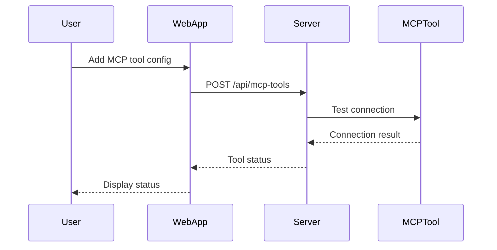
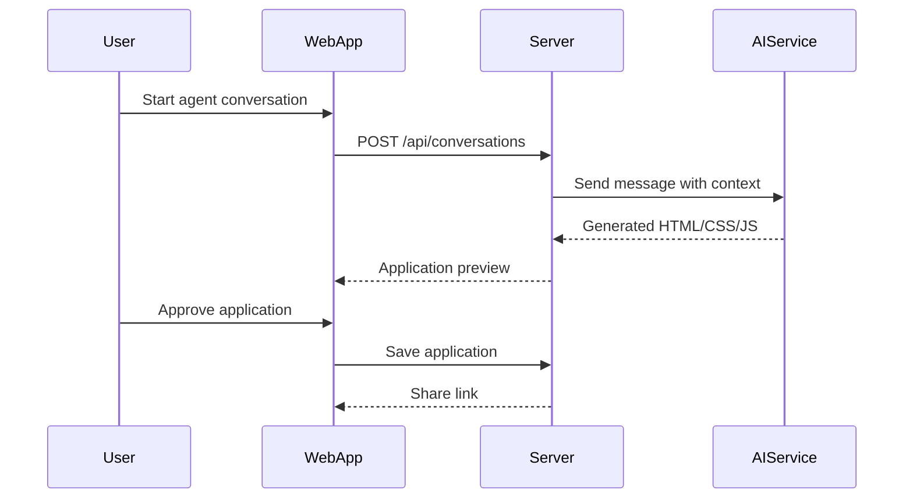

# **Core Workflows**

### **MCP Tool Connection Flow**

```mermaid
sequenceDiagram
    participant User
    participant WebApp
    participant Server
    participant MCPTool
    
    User->>WebApp: Add MCP tool config
    WebApp->>Server: POST /api/mcp-tools
    Server->>MCPTool: Test connection
    MCPTool-->>Server: Connection result
    Server-->>WebApp: Tool status
    WebApp-->>User: Display status
```

### **Application Creation Flow**

```mermaid
sequenceDiagram
    participant User
    participant WebApp
    participant Server
    participant AIService
    
    User->>WebApp: Start agent conversation
    WebApp->>Server: POST /api/conversations
    Server->>AIService: Send message with context
    AIService-->>Server: Generated HTML/CSS/JS
    Server-->>WebApp: Application preview
    User->>WebApp: Approve application
    WebApp->>Server: Save application
    Server-->>WebApp: Share link
```

