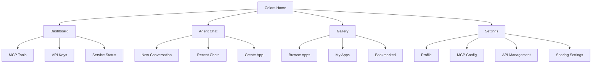
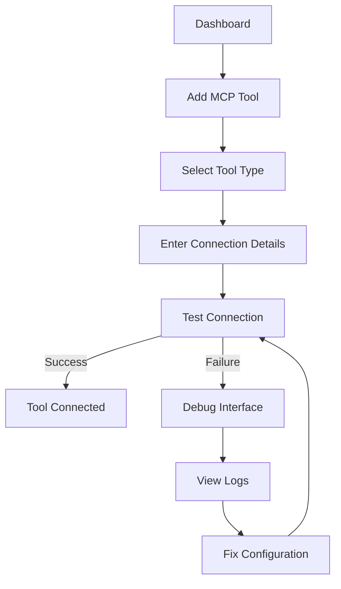
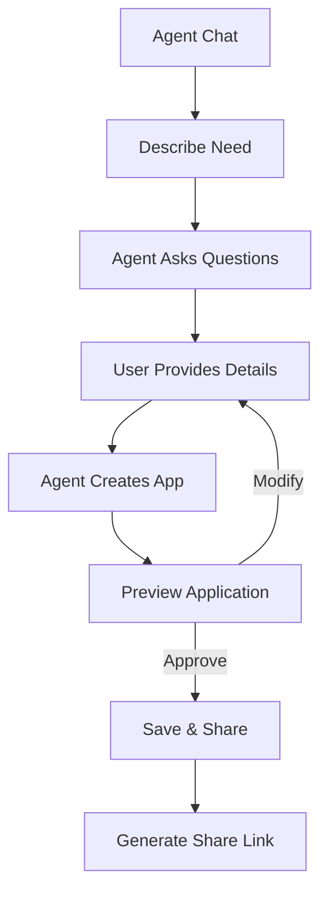
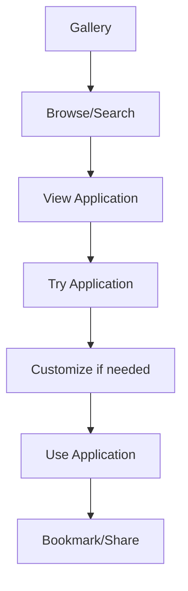

# **Colors UI/UX Specification**

## **Introduction**

This document defines the user experience goals, information architecture, user flows, and visual design specifications for Colors - the AI-powered MCP management and application sharing platform. The design prioritizes developer productivity while ensuring accessibility for non-technical users.

## **Change Log**

| Date | Version | Description | Author |
|------|---------|-------------|--------|
| 2025-08-27 | 1.0 | Initial UI/UX specification for Colors MVP | UX Expert |

## **Overall UX Goals & Principles**

### **Target User Personas**

**Primary: AI Power User (Alex)**

- **Role**: Experienced developer, 28-35 years old
- **Goals**: Efficiently debug MCP tools, create shareable AI applications
- **Pain Points**: Fragmented tooling, complex setup processes
- **Tech Comfort**: High - uses terminal daily, comfortable with APIs

**Secondary: AI Curious User (Sarah)**

- **Role**: Non-technical professional, 25-45 years old
- **Goals**: Access AI capabilities without technical complexity
- **Pain Points**: Overwhelming technical interfaces, unclear workflows
- **Tech Comfort**: Medium - uses web apps, avoids command line

**Tertiary: Developer Advocate (Marcus)**

- **Role**: Developer building for non-technical clients
- **Goals**: Create and share applications with simple interfaces
- **Pain Points**: Time-consuming to build user-friendly UIs
- **Tech Comfort**: High - builds applications, needs efficient workflows

### **Usability Goals**

- **Developer Efficiency**: Complete MCP tool setup in under 3 minutes
- **User Accessibility**: Non-technical users can create applications via conversation
- **Learning Curve**: Zero setup for shared applications
- **Error Recovery**: Clear guidance when MCP tools fail
- **Mobile Experience**: Core functionality accessible on mobile devices

### **Design Principles**

1. **Progressive Disclosure**: Show complexity only when needed
2. **Developer-Friendly**: Don't hide technical details, but make them optional
3. **Conversation-First**: Natural language as primary interaction method
4. **Visual Feedback**: Real-time status for all operations
5. **Share-Ready**: Every feature designed for sharing and collaboration

## **Information Architecture (IA)**

### **Site Map**

### **Navigation Structure**

**Primary Navigation** (Top navigation bar):

- **Dashboard** - MCP tool management and debugging
- **Agent** - Conversational interface for app creation
- **Gallery** - Browse and use applications
- **Settings** - Configuration and preferences

**Secondary Navigation** (Sidebar in dashboard):

- MCP Tools (connected/disconnected)
- API Keys (status indicators)
- Service Health (real-time status)

**Context Navigation** (Dynamic based on current view):

- Breadcrumb navigation for nested views
- Quick actions for common tasks
- Status indicators throughout

## **User Flows**

### **Flow 1: Developer Setting Up MCP Tools**

**User Goal**: Connect and debug MCP tools for development

**Entry Points**: Dashboard → MCP Tools section

**Success Criteria**: Successfully connected MCP tools with debugging capabilities

**Flow Diagram**:

**Edge Cases & Error Handling**:

- Invalid connection parameters → Clear error messages with examples
- Network timeouts → Retry mechanism with exponential backoff
- Authentication failures → Guided authentication setup
- Tool conflicts → Port conflict detection and resolution

### **Flow 2: Non-Technical User Creating Application**

**User Goal**: Create a custom AI application via conversation

**Entry Points**: Agent → Start Conversation

**Success Criteria**: Creates and shares a functional application

**Flow Diagram**:

**Edge Cases & Error Handling**:

- Unclear requirements → Agent clarifies with examples
- Technical limitations → Suggest alternatives
- Application fails → Debug mode with error details

### **Flow 3: Application Discovery and Usage**

**User Goal**: Find and use existing applications

**Entry Points**: Gallery → Browse Applications

**Success Criteria**: Successfully uses an application

**Flow Diagram**:

## **Wireframes & Mockups**

### **Primary Design Files**

- **Figma File**: [Colors Design System](https://figma.com/colors-design)
- **Component Library**: Based on shadcn/ui with customizations
- **Design System**: Colors Design System v1.0

### **Key Screen Layouts**

#### **Dashboard Screen**

**Purpose**: Central hub for MCP tool management and system overview

**Key Elements**:

- **Top Bar**: Logo, navigation, user profile
- **Sidebar**: MCP tool status (green/red indicators)
- **Main Content**:
  - Connected tools grid with status
  - Quick actions panel
  - Recent activity feed
  - System health metrics

**Interaction Notes**:

- Hover tooltips for tool status
- Click tool for detailed debugging
- Drag-and-drop tool reordering
- Keyboard shortcuts for power users

#### **Agent Chat Interface**

**Purpose**: Conversational AI interface for app creation

**Key Elements**:

- **Chat Area**: Message history with syntax highlighting
- **Input Bar**: Rich text input with MCP tool mentions
- **Side Panel**: Available tools and context
- **Preview**: Live application preview
- **Actions**: Save, share, debug buttons

#### **Application Gallery**

**Purpose**: Browse and discover applications

**Key Elements**:

- **Search Bar**: Full-text search with filters
- **Grid Layout**: Application cards with previews
- **Categories**: AI, productivity, entertainment
- **Stats**: Usage count, creator info, ratings
- **Actions**: Use, bookmark, share, fork

## **Component Library / Design System**

### **Design System Approach**

**Extended shadcn/ui**: Built on top of shadcn/ui with custom components for AI tooling and MCP management.

### **Core Components**

#### **MCP Tool Card**

**Purpose**: Display MCP tool status and actions

- **Variants**: Connected, Disconnected, Error, Loading
- **States**: Hover, Selected, Editing
- **Usage**: Dashboard, configuration screens

#### **Agent Message**

**Purpose**: Display AI agent messages with rich formatting

- **Variants**: User, Agent, System, Error
- **States**: Streaming, Complete, Failed
- **Usage**: Chat interface, logs viewer

#### **Application Card**

**Purpose**: Display applications in gallery

- **Variants**: Grid view, List view, Featured
- **States**: Hover, Bookmarked, Shared
- **Usage**: Gallery, search results, user collections

## **Branding & Style Guide**

### **Visual Identity**

**Brand Personality**: Modern, developer-friendly, accessible, powerful yet simple

### **Color Palette**

| Color Type | Hex Code | Usage |
|------------|----------|--------|
| Primary | #3B82F6 | Main actions, links, MCP connected state |
| Secondary | #8B5CF6 | AI agent interactions, highlights |
| Accent | #10B981 | Success states, share buttons |
| Success | #22C55E | Tool connected, operation successful |
| Warning | #F59E0B | Attention needed, warnings |
| Error | #EF4444 | Tool disconnected, errors |
| Neutral | #6B7280 | Text, borders, secondary elements |
| Background | #FFFFFF | Main background |
| Surface | #F9FAFB | Card backgrounds, subtle surfaces |
| Dark Background | #111827 | Dark mode background |

### **Typography**

| Element | Size | Weight | Line Height |
|---------|------|--------|-------------|
| H1 | 2.25rem (36px) | 700 | 1.2 |
| H2 | 1.875rem (30px) | 600 | 1.3 |
| H3 | 1.5rem (24px) | 600 | 1.4 |
| Body | 1rem (16px) | 400 | 1.5 |
| Small | 0.875rem (14px) | 400 | 1.4 |
| Code | 0.875rem (14px) | 500 | 1.5 |

### **Iconography**

- **Icon Library**: Lucide React icons
- **Usage Guidelines**:
  - Tool icons for MCP connections
  - AI icons for agent interactions
  - Status icons for system health
  - Social icons for sharing features

### **Spacing & Layout**

**Grid System**: 12-column responsive grid with 24px gutters

**Spacing Scale**:

- xs: 0.25rem (4px)
- sm: 0.5rem (8px)
- md: 1rem (16px)
- lg: 1.5rem (24px)
- xl: 2rem (32px)
- 2xl: 3rem (48px)

## **Accessibility Requirements**

### **Compliance Target**

**WCAG 2.1 Level AA** with AAA enhancements for critical workflows

### **Key Requirements**

**Visual**:

- Color contrast ratios: 7:1 for normal text, 4.5:1 for large text
- Focus indicators: 2px solid outline with 3px offset
- Text sizing: User can zoom to 200% without horizontal scroll
- High contrast mode support

**Interaction**:

- Keyboard navigation: Tab order follows logical flow
- Screen reader support: Semantic HTML and ARIA labels
- Touch targets: Minimum 44x44px for mobile
- Reduced motion: Respect `prefers-reduced-motion`

**Content**:

- Alternative text: All icons and images
- Heading structure: Logical H1-H6 hierarchy
- Form labels: Explicit labels for all inputs
- Error messaging: Clear, actionable error descriptions

## **Responsiveness Strategy**

### **Breakpoints**

| Breakpoint | Min Width | Max Width | Target Devices |
|------------|-----------|-----------|----------------|
| Mobile | 0px | 768px | Phones |
| Tablet | 768px | 1024px | Tablets |
| Desktop | 1024px | 1280px | Laptops |
| Wide | 1280px+ | - | Desktops |

### **Adaptation Patterns**

**Layout Changes**:

- Mobile: Single column, bottom navigation
- Tablet: Sidebar navigation, two-column layouts
- Desktop: Three-column layouts, side panels

**Navigation Changes**:

- Mobile: Bottom tab bar, slide-out sidebar
- Tablet: Collapsible sidebar
- Desktop: Fixed sidebar with hover states

**Content Priority**:

- Mobile: Chat interface, essential actions
- Tablet: Dashboard overview, tool status
- Desktop: Full debugging capabilities

## **Animation & Micro-interactions**

### **Motion Principles**

- **Purposeful**: Animations indicate state changes
- **Performant**: CSS transforms, 60fps target
- **Respectful**: Honor `prefers-reduced-motion`

### **Key Animations**

- **Tool Connection**: 300ms fade-in with scale effect
- **Agent Response**: 200ms slide-up for new messages
- **Status Changes**: 150ms color transitions
- **Loading States**: 1.5s subtle pulse animation
- **Success Feedback**: 400ms checkmark animation

## **Performance Considerations**

### **Performance Goals**

- **Page Load**: < 2 seconds on 3G
- **Interaction Response**: < 100ms for user actions
- **Animation FPS**: 60fps on modern devices
- **Bundle Size**: < 200KB gzipped for initial load

### **Design Strategies**

- **Code Splitting**: Route-based and component-based
- **Lazy Loading**: Images, heavy components, third-party libraries
- **Caching**: Service worker for offline capability
- **CDN**: Static assets on Vercel CDN
- **Prefetching**: Hover-to-prefetch for common actions
